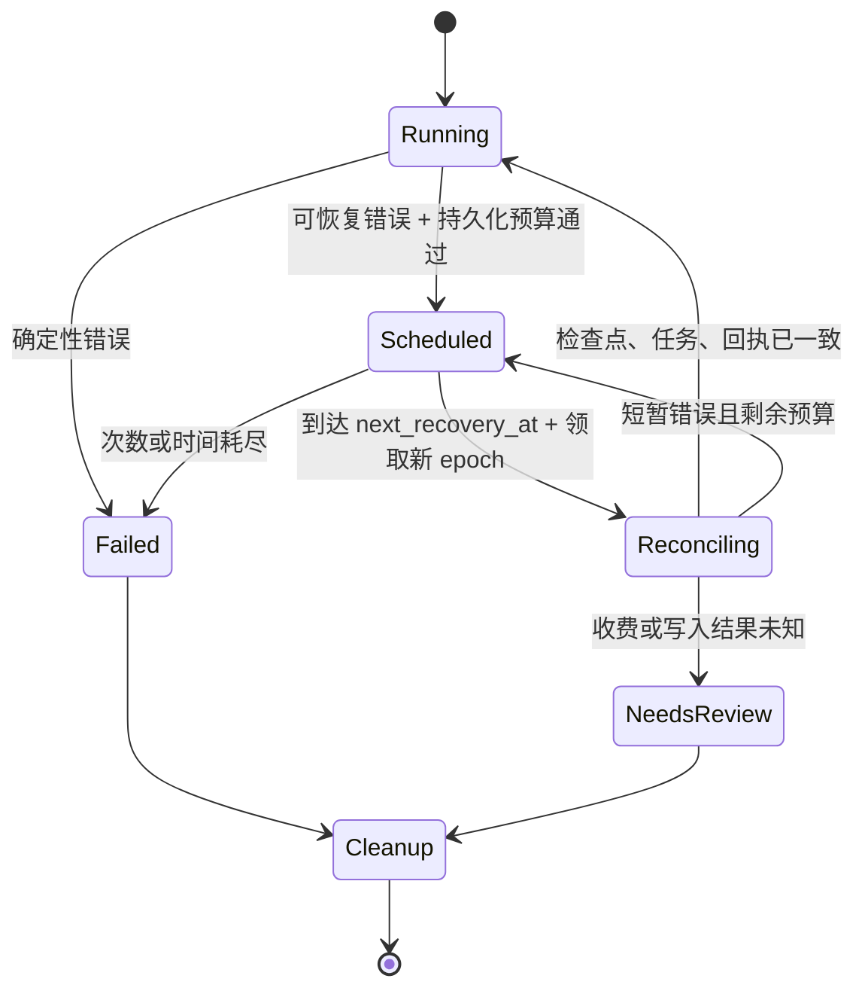

# Pi worker 错误恢复方案

状态：本次缺陷修复已在本地验证；持久化恢复控制器为待实施方案。未部署生产。

## 目标与证据边界

目标是让技能准入失败后的重新提交、worker 重启和短暂基础设施故障能够继续正确的步骤，同时防止重复画布写入、重复生成计费和永久 running。

用户报告技能集合的上下文估计为 2037941 字节，超过 524288 字节上限。提供的过滤日志记录了一个 worker 工具批次 403（“Agent 尚有未完成的模型或工具步骤”）及 25 条 PostgreSQL `SQLSTATE 22021` UTF-8 错误，没有记录技能准入错误或完整状态转换。

日志标注 agent 镜像版本 `6ccbb61`，本地修复基于 `43e2090a`；相关恢复与队列代码在镜像对应提交中同样存在。本地回归可重现同一工具批次错误模式，但缺少现场会话分支、任务及检查点，不能据此证明现场一定走了该路径，也不能认定技能准入直接产生了未完成模型任务。

## 当前实现与本次修复

### 1. 历史工具被当成当前工具恢复

`agent/src/runner.ts` 的 `recoverToolResults` 原先向后寻找带工具调用的 assistant，使用当前 `lastTaskId` 提交整个批次。原生 Pi 会话树包含上一轮的条目：上一轮终结但缺少工具回执，本轮 user 检查点已写入后重启，就会扫描到上一轮 assistant。该批次与本轮任务无关，在本轮有在途模型任务时触发 Go `PiToolBatch` 的 403 守卫。

已修复：

- 有 `activeTaskId` 时先恢复原模型任务，完成 assistant 检查点与确认，再处理工具。
- 原生会话树恢复只接受当前 `runId` 所属 assistant；用持久化消息的 timestamp 和 content 对应恢复分支中的消息。
- 历史未配对工具仅由现有 `createTerminalHistoryExtension` 生成模型输入中的“结果未知”说明，不执行工具，不写入伪造业务回执。

### 2. 检查点失败后仍继续批次提交

`CheckpointQueue` 原先记录错误后将 Promise 恢复为成功，后续入队任务仍被执行。assistant 检查点未成功时，批次也会被提交，继而触发未完成步骤守卫。

已修复：保留第一个错误，跳过全部依赖的后续写操作，由 `drain()` 抛出原错误。重新领取时以数据库检查点为恢复依据。

### 3. 日志截断损坏中文

`backend/internal/platform/api_call_payload.go` 原先直接截取前 128 KiB，可能切断 UTF-8 字符。现已在字符边界截断，将不合法输入替换为替代字符，将 NUL 转为可打印转义。这与日志中的半个中文字符后跟换行的字节模式一致；这是独立日志缺陷，未证明它导致本次 worker 403。

### 4. 技能准入仍按现有合同执行

`freezeRunSkillSnapshots`、Workspace 和 Crew 准入目前将包总字节作为上下文估计；512 KiB 是固定保守近似。`CreateCloudAgentRun` 在持久化执行记录之前进行检查，被拒绝的请求不应进入 worker。当前修复保持该合同，自动恢复也不能静默删技能或提高预算。

如需支持大量按需读取的技能，应另行实施：包容量仍检查文件数和总字节；模型输入只计实际目录、入口及读取页；每次模型调用按路由能力进行 token 准入和压缩。默认技能、Workspace、Crew、用户选择必须统一口径，不能只修改一个调用方或将包字节直接当 token。

## 方案选择

| 方案 | 优点 | 主要限制 |
| --- | --- | --- |
| 依赖进程重启与租约过期 | 改动少，已有会话持久化 | 无错误预算，持续领取可长期卡住 |
| worker 内存中自动重试 | 反馈快 | 重启清零，跨实例次数不一致，不能处理未知副作用 |
| Go 持久化恢复控制器 + worker 重建会话（推荐） | 多实例共享次数和进度，恢复可审计，沿用现有 fencing | 需要数据库字段、内部错误协议与故障注入测试 |

恢复策略由 Go 负责；Node 负责报告结构化故障、停止当前 Pi 会话、从新快照重建。保持现有 Go 对权限、任务、计费和工具准入的控制权。

## 错误分类

| 错误 | 建议处理 | 自动重试边界 |
| --- | --- | --- |
| `agent_skill_budget_exceeded` / 参数错误 | 提示减少选择或修正配置；拒绝创建运行 | 同输入不重试；修正后可用同键重新提交未曾成功创建的请求 |
| 普通 401 / 权限 403 / 冻结合同失效 | 运行明确失败并收尾；实例鉴权异常暂停领取、告警 | 不自动重试，不按错误文案推断类型 |
| `agent_lease_lost` | 立即停止模型、工具和写入 | 旧 owner 不续租、不 failRun；新 owner 按 epoch 接管 |
| 409 CAS 冲突 | 读新 snapshot 后重建状态 | 不原样重发旧 revision；纳入恢复次数预算 |
| 未完成模型/工具步骤 | 重读阶段与任务；先补检查点或读取现有回执 | 新增机器原因后才允许恢复；不将所有 403 自动转为可重试 |
| 408 / 425 / 429 / 5xx / 网络断连 | 记录恢复计划、退避后重建会话 | 请求结果不明时先查状态，禁止直接重发外部生成 |
| 模型空输出、超时、输出截断 | 沿用 Go 已有模型恢复阶梯 | 不再叠加一套重复模型重试计数；截断仍最多一次 |
| 上游生成或写入结果未知 | 查询已绑定 task / operation / 供应商 ID | 无法确认则需要人工核对，不再次收费或重复写入 |
| 会话损坏、schema 不兼容 | 确定性失败，保留证据并执行可行收尾 | 不循环压缩、重读或重新执行历史业务操作 |

工具忙碌的现有 403 应在独立协议变更中改为 409 + `agent_step_pending`，并通过 epoch、TaskID、真实模型结果和原始 Calls 校验后才恢复。当前补丁没有放宽 Go 守卫，也没有将 HTTP 错误分类改成按中文文案判断。

## 持久化恢复合同（待实施）

在执行记录中增加下列控制字段，并同步数据库迁移、模型、内部 API 和数据库文档：

- `recovery_attempts`、`recovery_started_at`、`next_recovery_at`。
- `recovery_class`、`recovery_operation_id`、`recovery_task_id`、`recovery_call_id`、`last_error_reason`。
- `progress_version`、`last_progress_at`：业务推进与心跳分开。
- `recovery_status`：`none` / `scheduled` / `reconciling` / `exhausted` / `needs_review`。

错误上报增加内部接口 `POST /internal-agent/runs/:id/recovery`，入参只含操作身份、错误枚举与 HTTP 状态，不传用户正文、密钥、Cookie、原始报文或临时绝对路径。

上报必须匹配 user、owner、lease epoch、运行 revision 和当前任务/操作；去重身份采用已有 run + epoch + 操作 ID + 错误分类。重复上报不重复增加次数。Go 在同一事务更新恢复计划、事件/outbox 和租约；更新失败不把本地计划当成已保存。

Node 必须先中止 Pi session，取消轮询与续租并等待正在执行的本地回调结束，再交还执行权。网络断连时无法报告或释放则让原租约自然过期，接管端必须核对已提交任务/操作结果。租约 fencing 不能保证上游取消成功。

## 恢复状态与步骤

`Scheduled` 等状态是恢复控制状态，第一阶段无需改变公开 Run 状态枚举；运行可保持 running，但 `runtimePhase` 显示恢复等待。`NeedsReview` 将 Run 终结为 failed 并记录 requiredAction，未知账单保持待核对，不自动退款或重收。

每次接管按以下顺序核对：

1. 终态直接结束；旧 lease epoch 立即退出；校验冻结 Harness、技能和会话格式。
2. 有未完成 compaction 时恢复同一 operation，提交既有源 revision/leaf，不创建第二笔压缩任务。
3. 有 `activeTaskId` 时查询同一模型任务；成功后写 assistant 检查点 + 原子确认；排队/运行则继续等待。
4. 有当前轮工具批次时读取已完成回执，剩余调用按原 TaskID + CallID 推进。存在收费任务时先查任务，已有媒体任务复用既有绑定。
5. 上一轮工具历史只投影“结果未知”，不能使用当前 TaskID 重新准入。
6. user 已写入但尚未开始模型步骤时，沿持久化父叶恢复请求；确认无在途步骤后才创建模型任务。

候选默认值：每个无进展故障周期最多 5 次、总计 10 分钟；指数退避窗口从 1 秒递增到 30 秒并加随机抖动。429 优先使用 `Retry-After`；超过剩余恢复时间则停止并明确失败。参数应作为可配置策略，并先经测试环境验证。

只在任务确认、工具回执、会话检查点或压缩提交等可核实推进后结束当前故障周期。实例重启、领取、续租、run revision 增加都不能清零次数；同一 task/call 的故障累计单独保留。

## 看门狗、熔断与清理

当前 `SweepStalledPiAgentRuns` 依赖租约过期 6 × 45 秒；反复领取会延后过期，续租也不代表业务有进展。恢复控制器应直接检测持久化预算和 `last_progress_at`，不得仅靠 lease_expires_at。

避免误杀正常长任务：`waiting_model` / `waiting_tool` 检查对应任务租约、超时与进度；`waiting_approval` / 用户输入等待使用各自明确期限；恢复失败耗尽才进入终态。持续后端网络或鉴权故障采用实例级熔断暂停领取，避免制造大量 run_failed；定期健康探针通过后恢复。

终态转换与 `CleanupPending` 同事务提交；沿用现有 cleanup drain 取消可取消子任务、释放资源租约、处理占位预留和媒体结果。未知供应商费用不能按本地终态自动退款。`failRun` 请求失败须有可重试上报或过期兜底，不能只吞掉失败后认定运行已终结。

## 观测与验收

- 事件：`worker_recovery_scheduled`、`worker_recovery_started`、`worker_recovery_completed`、`worker_recovery_exhausted`。字段只含操作身份、分类、次数、延迟和阶段。
- 指标：恢复次数与耗时、耗尽数、epoch 失效数、未知结果数、终态 cleanup 积压、无进展运行数。
- 计费验收：任意断点重启后，同一逻辑生成仅有一个有效任务与绑定订单；无法确认上游结果时停在待核对。
- 故障注入：模型完成但确认前、工具执行成功但回执前、checkpoint 成功但 HTTP 响应丢失、混合原生 read/画布工具、worker 多次重启、并发 CAS、429、PG/Redis 短暂断连、旧 epoch 延迟回调。
- 准入验收：超预算请求没有新增 Run/任务/订单/会话技能；修正输入后可创建新轮，既有运行不能直接重用请求键改变输入；历史未配对工具不产生业务操作。

## 实施与发布顺序

1. **本次补丁**：历史恢复隔离、检查点队列停止依赖操作、日志 UTF-8 修复及本地回归。
2. **协议与持久化**：错误枚举、恢复计划字段、epoch/CAS 上报、去重和累计预算；同步数据库/API 文档。
3. **控制器与 worker**：退避领取、阶段协调、耗尽终态、cleanup/outbox、实例熔断与恢复事件。
4. **测试环境**：真实 PostgreSQL/Redis 与至少两个 worker 的断点及网络故障注入，核对实际任务、订单和媒体落点。
5. **生产发布**：操作前复盘计划并评估风险；保存当前镜像与配置，排空运行后分阶段发布。验收旧会话重试、新会话准入、无重复收费及 cleanup。仅健康接口通过不能宣称事故链路修复。

本次没有执行步骤 2–5。当前补丁无需数据库迁移，可回滚 agent/backend 镜像；未来恢复字段迁移应采用可回退的增量字段，回滚时保留恢复审计和账单事实。

## 本地验证

- 新 runner 回归在修复前失败：assistant 检查点失败后仍有批次；继承旧轮未回执工具时重现错误提示。
- 修复后 runner、session-history、event-scheduler 共 58 项通过；bridge-wire-contract、bridge-usage 共 20 项通过；TypeScript 编译通过。
- 新日志回归在修复前失败：字符边界截断与不合法 UTF-8/NUL；修复后 `go test ./internal/platform -count=1` 通过。
- 本机 Go 默认缓存无写权限，CGO 编译器受执行环境限制；platform 验证使用工作区 GOCACHE 与 `CGO_ENABLED=0`，该包不需要 SQLite 执行。未进行 PostgreSQL 实测或后端 SQLite 集成验证。
- 独立代码审查未发现需修正的问题。现场原会话恢复和生产发布仍待验收。
