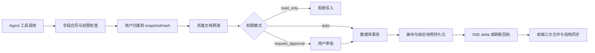

# 画布 Agent 节点与内容操作

本次开发目标是让 Agent 可以通过受校验的工具，执行核心画布上用户可编辑的节点、连线和内容操作。所有操作仍以当前用户、当前画布和运行的权限模式为边界。实现位于 `codex/canvas-agent-parity`，基线 `b277b753`；本地验收项目与既有 3030 项目隔离。

## 已实现范围

| 对象 | Agent 能力 |
| --- | --- |
| 18 种内置节点 | 创建、读取、更新、复制、删除；位置、尺寸、标题、锁定、颜色及节点专属字段按合同校验 |
| 角色卡 | 通过现有角色工具创建；变体合同读取和更新，普通素材不能覆盖角色身份 |
| 连线与容器 | 建立、移除、重连、端口校验、分组/解除分组、完整节点顺序调整 |
| 文本 | Unicode 分页精读、搜索、正文/富文本更新、唯一片段替换，避免摘要截断导致正文丢失 |
| 分镜与批量表 | 行增删改、完整行排序、列/并发/提示词编辑、类型匹配的画布素材引用 |
| 素材库 | 当前用户素材查询、匹配类型素材替换，清除旧任务及产物身份；节点删除保留资源原文件 |
| 原生绘图 | 编辑器保存同步原生文档；分页读取、完整记录 upsert/remove、独立副本；tldraw 5.2.5 原生字段和引用校验 |
| 操作历史 | 本运行内逐步撤销/重做；新变更原子废弃重做分支，快照冲突拒绝覆盖后续变更 |

工具新增：`canvas_read_content`、`canvas_search_nodes`、`canvas_read_drawing`、`canvas_edit_drawing`、`canvas_list_assets`、`canvas_bind_asset`、`canvas_undo`、`canvas_redo`。`canvas_apply_ops` 支持 11 类操作；复杂字段先通过 `canvas_list_node_types(nodeType)` 获取完整合同。

## 写入和同步

预演和执行共用规划器。批次任一操作失败时不提交部分文档。修改生成草稿时同步规范化 generationSpec 与旧字段；不开放任意 metadata、任务状态、凭证、价格或资源 URL 写入。已提交任务不会因撤销取消或退款，不可撤销的生成提交作为历史屏障。

删除清理关联连线、分镜/批量引用和父级；删除容器解除成员归属。复制保留编辑内容，重新映射内部成员/连线/原生文档 ID，并清除任务、费用及输出身份。远端删除、重排和绘图更新通过前端结构合并处理；绘图已发布缓存接受服务端撤销，未发布的新草稿保持本地版本。

## 代码入口

- `backend/internal/canvas/capability/`：内置节点、类型化字段与行合同、读取投影、生成参数镜像。
- `backend/internal/app/cloud_agent_tools.go`、`cloud_agent_runtime.go`：工具目录、权限和审批/执行分派。
- `cloud_agent_approval_preview.go`、`cloud_agent_operations.go`、`cloud_agent_copy.go`：原子规划、引用清理和复制。
- `cloud_agent_content.go`、`cloud_agent_asset_binding.go`：正文精读/搜索和素材绑定。
- `cloud_agent_drawing.go`、`cloud_agent_tldraw_validation.go`：原生记录、平台图片资源归属与格式校验。
- `cloud_agent_history_tools.go`、`repository/cloud_agent.go`：撤销/重做栈及原子分支切换。
- `web/src/lib/canvas/agent-canvas-patch.ts`、`canvas-entity-reconciliation.ts`：SSE 三方合并、删除与排序。
- `canvas-drawing-document-sync.ts`、`canvas-drawing-storage.ts`：原生同步、图片资源外置和缓存协调。
- `web/test/fixtures/`：手动与 Agent 共用操作用例，以及真实 tldraw 引擎生成的原生记录。

数据库版本为 **58**：在 `cloud_agent_canvas_mutations` 增加 `after_json`，用于重做。旧记录保留；没有 after_json 的旧操作不能重做。

## 适用边界

核心节点编辑不等于执行所有节点业务。滤镜/转换等参数可编辑，浏览器导出、渲染、插件专属操作仍需对应业务执行器。第三方未知节点不提供新增字段合同。

单次模型工具参数仍受运行时的 32,000 字节限制；长正文用分页精读和唯一片段修改，节点正文容量不等于单次调用容量。

原有仅存本机的绘图需先在编辑器打开并保存一次才能同步，不能按空白覆盖。tldraw 新文档需先同步原生 schema；读取工具提供完整 geo 示例，其他类型应复制其完整原生记录再修改。当前绘图资源同步支持图片，视频/书签素材的 Agent 编辑明确拒绝。远端绘图编辑会清除旧预览，新预览由编辑器保存时重新生成。

本次测试不把确定性模型协议夹具当作真实大模型理解能力证明，也不把数据与引擎测试当作浏览器页面交互验收。

## 验证与复现

真实 Compose 验收入口为 `scripts/verify-agent-canvas-parity.py`；项目、端口、隔离数据及构建方式见 `tools/agent-parity.README.md`。夹具仅替换 OpenAI 模型协议，实际执行 Pi worker、Go 后端、SQLite 持久化、审批和 SSE。

前端：138 项测试 / 17 文件通过，TypeScript 检查及 Vite 生产构建通过。包括多页文档保存、已发布缓存撤销、撤销恢复节点/行原位置、实际 tldraw loadSnapshot 与笔迹解码。

后端：Linux Docker 中使用 CGO/真实 SQLite 验证新增操作、审批、用户归属、冲突、资源安全、历史分支以及 v58 升级；Windows `CGO_ENABLED=0` 的纯函数检查仅用于字段、规划与 native 格式，不替代数据库测试。

本地 Compose 采用分阶段验收：主体 59 项通过，原总等待超时的多步历史运行随后通过租约恢复自然完成；收尾 11 项全部通过，仅补测旧撤销接口、重启持久化和 SSE，并只读确认既有历史结果。使用同一组镜像，重启后 schema 58/58、画布持久化和 3030 容器保持通过；不是一次全量脚本连续通过。SQLite 暂态锁冲突仍可能增加恢复耗时。

完整证据说明见 `docs/design/canvas-agent-parity-test-report.md`，脱敏机器报告为 `.local/agent-parity-acceptance-final-third-failure.json` 与 `.local/agent-parity-continuation.json`。凭据文件不得提交。
